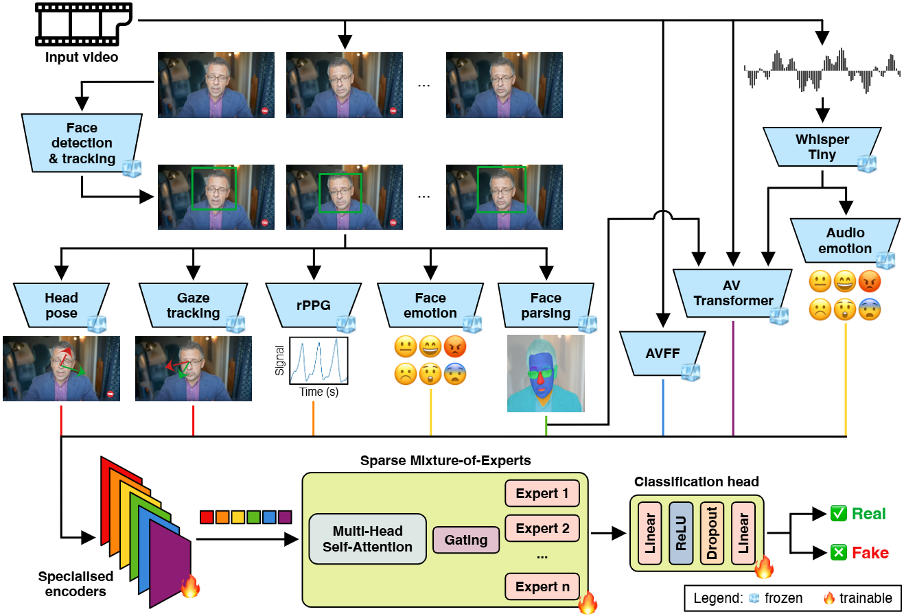

# DF-MoE: Generalizable Deepfake Detection via Multimodal Sparse Mixture-of-Experts

Accepted at The British Machine Vision Conference (BMVC) 2026.



## Abstract
Audio-visual deepfake detection is an actively studied topic, where one of the main
challenges is to develop detectors able to generalize across deepfake generation methods. We conjecture that overfitting can be mitigated by extracting multiple high-level
cues from the available audio and visual modalities via pre-trained models. We therefore assemble a wide variety of pre-trained models to extract features that encode mouth
movements, face parsing, facial expressions, head pose, gaze tracking, heart rate, audio
emotion and speech activity. We further integrate both unimodal and multimodal cues
via a Mixture-of-Experts (MoE) backbone to detect deepfakes. We perform in-domain
and cross-domain experiments on five benchmarks for deepfake detection (MAVOS-DD,
AVLips, PolyGlotFake, BioDeepAV, FakeAVCeleb) to compare our framework (DFMoE) with state-of-the-art methods. Our results indicate that DF-MoE obtains superior
deepfake detection results, surpassing all competing methods

## Citation
If you have used our work, please cite our paper.

>Vlad Hondru, Florinel Alin Croitoru, Iuliana Georgescu, A. Sophia Koepke, Radu Tudor Ionescu  (2026, November). DF-MoE: Generalizable Deepfake Detection via Multimodal Sparse Mixture-of-Experts. In 2026 The British Machine Vision Conference (BMVC)

Bibtex:
```bibtex
@inproceedings{hondru-BMVC-2026,
  title={DF-MoE: Generalizable Deepfake Detection via Multimodal Sparse Mixture-of-Experts},
  author={Vlad Hondru, Florinel Alin Croitoru, Iuliana Georgescu, A. Sophia Koepke, Radu Tudor Ionescu},
  booktitle={2026 The British Machine Vision Conference (BMVC)},
  year={2026}
}
```


## Instructions
Download the repo:
```
git lfs install
GIT_LFS_SKIP_SMUDGE=0 git clone git@github.com:vladhondru25/DF-MoE.git
cd DF-MoE
git checkout release
```

### Environment

```
conda create -n biodeep python=3.12
conda activate biodeep
pip install torch==2.7.0 torchvision==0.22.0 torchaudio==2.7.0 torchcodec==0.5.0
pip install -r requirements.txt


```
### Model weights:
All checkpoints are available at: https://huggingface.co/acroitoru/DF-MoE/

Paper experiments: best_moe_multiple_datasets_cro_loss.pt
Social media experiments: The remaining checkpoints at the link above come from additional experiments on social media videos. These were completed after the submission deadline and fall outside the scope of the paper, so they are not reported in the article. We recommend them for social media deepfake detection, though this setting proved more challenging than the academic benchmarks.
## How to run detection on single video
`python inference_scripts/inference_video.py --video_path path/to/video.mp4 --checkpoint_path path/to/checkpoint`

We recommend using the Mixture of Experts (MoE) model, which integrates all available signals to reach a final decision. You can run this model using a command similar to the following:

`python inference_scripts/inference_video.py --video_path assets/fake/morgan_freeman_fixed.mp4 --checkpoint_path <checkpoint_path>`


Only identities tracked for at least 10 frames are analyzed. For each of them, a cropped face thumbnail is saved to `results/{video_name}/identities/{identity}.png`, so you can tell which detected identity each score belongs to.

The analysis results are exported to a structured JSON format and organized by video name.

The output provides a granular breakdown of "fakeness" scores, structured as follows:

- Sequence Level: A fakeness score is assigned to every individual video sequence processed during the analysis.

- Identity Level: For every unique identity detected, a global fakeness score is provided. This is calculated as the mean of all sequence scores associated with that specific identity. It is accompanied by a `decision` ("Real"/"Fake", based on the calibrated threshold in `config/config.json`) and a `confidence` score for that decision.

```
{
    "1": {
        "fakeness score per sequence": [
            "0.0057423115",
            "0.023903668",
            "0.20365149",
            "0.013340235",
            "0.9999289",
            "0.9999399",
            "0.999942",
            "0.99993587",
            "0.999985",
            "0.9999786",
            "0.42827094",
            "0.4017446",
            "0.9986483",
            "0.99985445",
            "0.016581476",
            "0.018082023",
            "0.9999463",
            "0.9999918",
            "0.9999887",
            "0.99998325",
            "0.99998605"
        ],
        "identity fakeness score": "0.6718774",
        "decision": "Fake",
        "confidence": 0.87
    },
    "2": {
        "fakeness score per sequence": [
            "0.9999518",
            "0.9999641",
            "0.9999624",
            "0.9999639",
            "0.9999853",
            "0.9999871",
            "0.999981",
            "0.9999639",
            "0.9999815"
        ],
        "identity fakeness score": "0.9999713",
        "decision": "Fake",
        "confidence": 0.95
    }
}
```


## Train

Before training any of the models, extract the per-frame face/audio features from your video dataset:

`python feature_extraction_scripts/extract_features.py --input_path path/to/videos --output_path path/to/interim_outputs`

This recursively discovers video files (`.mp4`, `.avi`, `.mov`, `.mkv`, `.webm`) under `--input_path` and writes the extracted features to `--output_path`, mirroring the same directory structure as the input.

Next, run audio emotion inference on the extracted audio features to update the `data.pkl` files with `emotion_audio` predictions:

`python feature_extraction_scripts/extract_audio_emotions.py --input_path path/to/interim_outputs`

This recursively discovers `audio_features.pt` files under `--input_path` (the same directory produced by the previous step) and updates each corresponding `data.pkl` in place, independent of the surrounding directory structure.

Then, reformat the per-frame features into a Hugging Face dataset:

`python feature_extraction_scripts/reformat_ds.py --input_path path/to/interim_outputs --video_data_dir path/to/videos --output_dir path/to/restructured_dataset`

This recursively discovers `data.pkl` files under `--input_path`, independent of the surrounding directory structure, and matches each one back to its source video under `--video_data_dir` by relative path.

Finally, reformat the extracted audio features into their own Hugging Face dataset:

`python feature_extraction_scripts/reformat_ds_audio.py --input_path path/to/interim_outputs --output_dir path/to/restructured_dataset_audio`

This recursively discovers `audio_features.pt` files under `--input_path`, independent of the surrounding directory structure.

Finally, train the Mixture-of-Experts (MoE) model. It uses `torchrun` for distributed training and reads directly from the per-dataset feature/split loaders (not the Hugging Face datasets produced above), so no further reformatting is needed beyond the extraction steps:

`torchrun --nproc_per_node=2 train_scripts/train_moe.py --epochs 20 --batch_size 4 --train_datasets mavos,avlips,celebdf,social_media --val_dataset mavos --wandb_run_name my_run`

`--train_datasets` is a comma-separated list of dataset names combined (equally, randomly resampled every epoch) for training; `--val_dataset` picks a single dataset for validation. Available names: `avlips`, `celebdf`, `social_media`, `mavos`. See `train_scripts/train_moe.sh` for a full example including checkpoint warm-starting flags (`--ckpt_av_tf`, `--ckpt_avff`, etc.), or run `python train_scripts/train_moe.py --help` for the complete list of options.


## Test

Evaluate a trained checkpoint against a held-out dataset's precomputed features (produced by the feature-extraction steps above). It also uses `torchrun` for distributed inference:

`torchrun --nproc_per_node=2 test_scripts/test_moe.py --checkpoint_path model_checkpoints/last_moe.pt --path_features_video path/to/features/video --path_features_audio path/to/features/audio --save_path predictions/my_run --batch_size 2 --num_workers 12`

`--path_features_video` picks which dataset loader is used, based on a substring match against the path (`mavos`, `avlips`, `celebdf`, `social`, `fakeavceleb`, `deepfakeeval`, `polyglot`, `biodeepav`, `vox`, `test_videos`). Predictions are written as a Hugging Face dataset to `--save_path` suffixed with the process rank — one shard per distributed process, so `--nproc_per_node=2` produces `predictions/my_run0` and `predictions/my_run1`. See `test_scripts/test_moe.sh` for a full example, or run `python test_scripts/test_moe.py --help` for the complete list of options.

Then aggregate the prediction shards into accuracy/mAP/AUC stats and a confusion matrix, logged to Weights & Biases:

- Against MAVOS-DD's evaluation splits (closed-set, open-model, open-language, open-set):

  `python stats/compute_stats_mavos.py --predictions_paths predictions/my_run0,predictions/my_run1 --mavos_path path/to/MAVOS-DD`

- Against any other predictions dataset:

  `python stats/compute_stats_not_mavos.py --predictions_paths predictions/my_run0,predictions/my_run1 --split_name "My Eval Set"`

Both scripts take `--predictions_paths` as a comma-separated list of the rank shards to concatenate (from `test_scripts/test_moe.py`, or any other compatible predictions dataset), and save the confusion matrix PNG under `--output_dir` (default `confusion_matrices/{wandb_name}/`).

## License

This repository is licensed under the [Creative Commons Attribution-NonCommercial-NoDerivatives 4.0 International](https://creativecommons.org/licenses/by-nc-nd/4.0/) license (CC BY-NC-ND 4.0). See [LICENSE](LICENSE) for the full terms.


